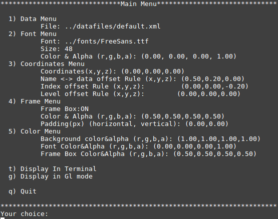
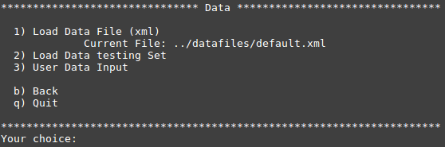
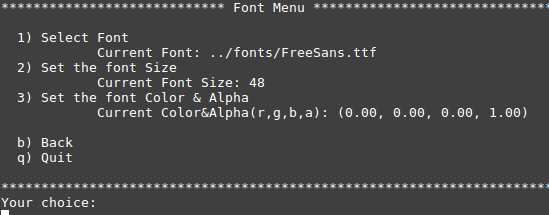
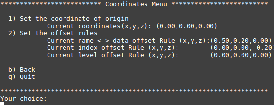
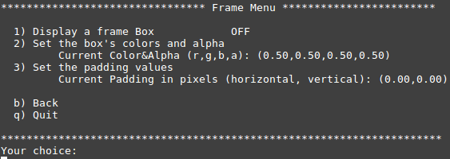
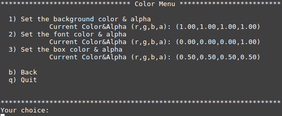
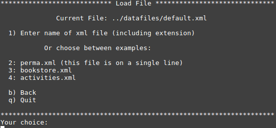
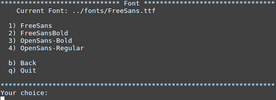
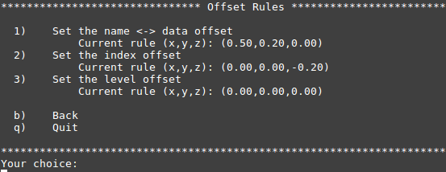

##### Doc version: 2.1
##### Author: Gwenole Capp
##### email: gwenole.capp@gmail.com
---
## 
Multidimensional Data Entity - GL display

### 
Version 0.3.2

A Multidimensional Data Entity is an instance of an object of class **MDE**.
The base class **MDE** has 3 member variables:
#### public: std::string data
#### private: std::string name
#### private: std::vector<*MDE> vMDE

#### The public member *data* holds all data assigned to the private member *name*, can store strings of any size and can include the space character.
#### The private member *name* holds a string of any size but no space character should be included, it acts as a name for the MDE internally.
#### The private member *vMDE* is a standard vector of pointers to instances of MDE, that is what gives the multidimension capability of a MDE instance.

##### Main documentation and detailed API can be found <a href="http://lesgwenos.freehostia.com/MDE_v0.1/html/index.html">here</a>
---
For now the **MDE** program offers two display modes. The text mode and the openGL (g) mode.
The text mode displays menus in the terminal, it is used for testing and development.
The openGL mode displays the instance of an *MDE* object in an openGL context, it later will be used as a GUI and as a rendered viewport in 3D.

---
## Menu flow in text mode

### Main menu:

#### Option <big>1</big> opens the [Data Menu](#data-menu), select if you want to load a file.
##### The path and name of the file that is currently loaded into the MDE instance is displayed under option 1.

#### Option <big>2</big> opens the [Font Menu](#font-menu), select if you want to change the Font, the Font size or the Font Color.
##### The current Font, Font size and Font colors & Alpha are displayed.

#### Option <big>3</big> opens the [Coordinates Menu](#coord-menu), select if you want to change the coordinates of the master of the MDE instance, or to set the rules for the offset betweens the element of a MDE instance.

##### The Current coordinates and current rules are displayed.

#### Option <big>4</big> opens the [Frame Menu](#frame-menu), select if you want to display a frame box behind the text for each 'name' and 'data' of an MDE instance, to set the colors and alpha for that frame box or set horizontal and vertical padding values for displaying the text within that frame box.

#####  ON/OFF indicator  for the display of the frame box is shown, also the Colors & Alpha for the frame box and the padding are displayed.

#### Option <big>5</big> opens the [Color Menu](#color-menu), select if you want to change colors and alpha for the background, the font or the frame box (if the frame box display is on).

##### The current colors and Alpha are displayed here for the Backgound, the Font and the Frame Box, if the Frame Box switch is ON (in the Frame Menu).

#### Option <big>t</big> displays the MDE instance in the terminal.

#### Option <big>g</big> displays the MDE instance in an openGL context (using freeglut).

---

### <a name="data-menu">Data Menu</a>

#### Option <big>1</big> opens the [Load File](#load-file), select if you want to load a file.

##### The path and name of the file currently loaded is displayed .

#### Option <big>2</big> is to load a hard coded dataset used for testing.

#### Option <big>3</big> is for entering manually and recursively names and data into the MDE instance.
##### Starting from the master Entity, you enter name and data then create sub-entities by entering name and data for each indexes, starting with the level just after the master Entity and going top to bottom, until user type 'end' in the name of each branches created.(to clarify)

#### You can save a data set as an xml file after options <big>2</big> or <big>3</big>.

#### Option <big>b</big> is to go back to the parent menu.

#### Option <big>q</big> is to quit the program.

---

### <a name="font-menu">Font Menu</a>

#### Option <big>1</big> opens menu [Font](#font) to a font from a list.

##### The current font is displayed.

#### Option <big>2</big> is to enter Font Size as an non-signed integer.

##### The current Font size is displayed.

#### Option <big>3</big> is to enter the (R,G,B,A) float values for the Colors and Alpha for the Font.

##### The current (R,G,B,A) for the Font are displayed.

#### Option <big>b</big> is to go back to the parent menu.

#### Option <big>q</big> is to quit the program.

---

### <a name="coord-menu">Coordinates Menu</a>

#### Option <big>1</big> is to enter the (x,y,z) float values as coordinate for the master entity of the MDE instance.

##### The current coordinates of the master entity is displayed.

#### Option <big>2</big> is to open the [Offset Rules](#offset-rules) menu, select if you want to change the offset rules  determining the distance between each type of elements of a MDE instance.

##### All current rules's (x,y,z) values are displayed.

#### Option <big>b</big> is to go back to the parent menu.

#### Option <big>q</big> is to quit the program.

---

### <a name="frame-menu">Frame Menu</a>

#### Option <big>1</big> is to switch ON/OFF the fame box display. The frame box is an individual 3D colored box on which the text is displayed.

##### The current state of the switch is displayed (ON or OFF).

#### Option <big>2</big> is to enter the (R,G,B,A) float values for the Colors and Alpha for the Frame Box.

##### The current (R,G,B,A) for the Frame Box are displayed.

#### Option <big>3</big> is to enter the horizontal and veticale float values for the Padding between the edge of the Frame box and the text.

##### The current horizontal and vertical padding values are displayed.

#### Option <big>b</big> is to go back to the parent menu.

#### Option <big>q</big> is to quit the program.

---

### <a name="color-menu">Color Menu</a>

#### Option <big>1</big>  is to enter the (R,G,B,A) float values for the Background of the openGL viewport.

##### The current (R,G,B,A) for the Background are displayed.

#### Option <big>2</big> is to enter the (R,G,B,A) float values for the Colors and Alpha for the Font.

##### The current (R,G,B,A) for the Font are displayed.

#### Option <big>3</big> is to enter the (R,G,B,A) float values for the Colors and Alpha for the Frame Box. It is available only if the Frame BOx display switch is set to ON.

##### The current horizontal and vertical padding values are displayed (If the Frame box switch to ON).

#### Option <big>b</big> is to go back to the parent menu.

#### Option <big>q</big> is to quit the program.

---

### <a name="load-file">Load File</a>

#### The path and name of the current loaded file is displayed.

#### Option <big>1</big>  is to enter the name and path of the file to load. The file has to be in the ../datafiles folder and include the extension (most likely xml).

#### Options <big>2</big>, <big>3</big> and <big>4</big> are to load some example/testing files.

#### Option <big>b</big> is to go back to the parent menu.

#### Option <big>q</big> is to quit the program.

---

### <a name="font">Font</a>

#### The current Font name is displayed.

#### Options <big>1</big>, <big>2</big>, <big>3</big> and <big>4</big> are to select the Font.

### <a name="offset-rules">Offset Rules</a>

#### Option <big>1</big> is to enter the (x,y,z) float values as coordinate offset between the elements name and data of each entities of the MDE instance.

##### The current offset rule (x,y,z) for name<->data is displayed.

#### Option <big>2</big> is to enter the (x,y,z) float values as coordinate offset between the indexes of within vMDE sub-entities of the MDE instance.

##### The current offset rule (x,y,z) for index is displayed.

#### Option <big>3</big> is to enter the (x,y,z) float values as coordinate offset between the levels of each sub-entities of the MDE instance.

##### The current offset rule (x,y,z) for level is displayed.

#### Option <big>b</big> is to go back to the parent menu.

#### Option <big>q</big> is to quit the program.

---

### Mouse control in Graphic Mode menu:
#### Use Mouse <big>*Left click*<big> to look around right, left, up or down with the camera .
#### Use Mouse <big>*Wheel*<big> to zoom in or out.
### Keyboard control in Graphic Mode menu:
#### Use keys WASD or arrow keys to move camera:  
##### &nbsp;&nbsp;&nbsp;&nbsp;&nbsp;&nbsp; W or up to move forward
##### &nbsp;&nbsp;&nbsp;&nbsp;&nbsp;&nbsp; S or down to move backward
##### &nbsp;&nbsp;&nbsp;&nbsp;&nbsp;&nbsp; A or left to move left
##### &nbsp;&nbsp;&nbsp;&nbsp;&nbsp;&nbsp; D or right to move right
#### Use key <big>*ESC*<big> to exit the program.
